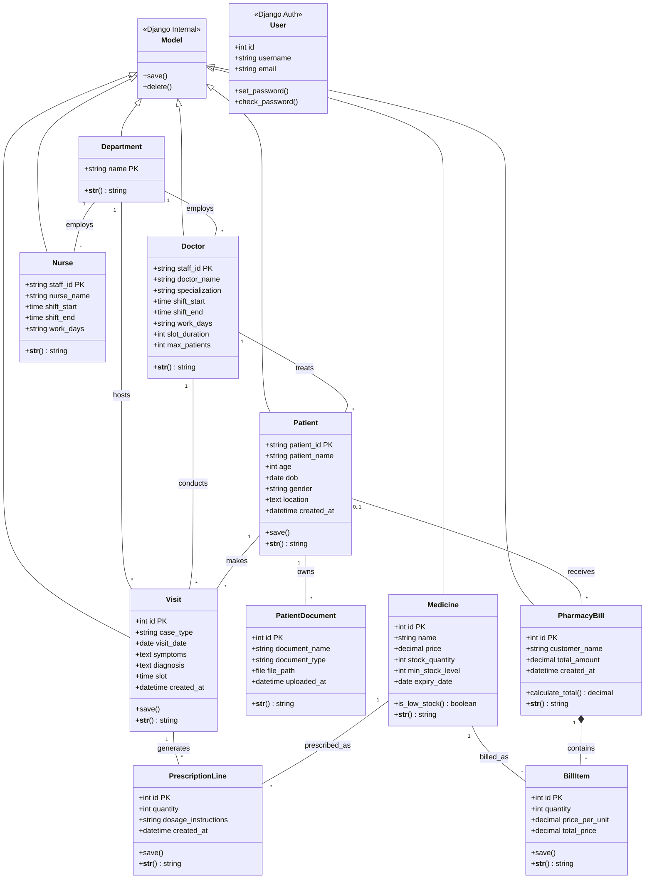

# PredictCare Hospital Management System - High-Fidelity Class Diagram

This document contains a comprehensive Unified Modeling Language (UML) Class Diagram for the PredictCare Hospital Management System. It illustrates the relationships, multiplicities, attributes, and methods for all core entities in the system.

---

## 1. Professional Relational Architecture

The following diagram maps out the system's class structures and multiplicities (1-to-N and Many-to-Many), following the design style and logical depth of the "PROCTOR EDGE" reference.

---

## 2. Diagram Legend & Relationship Definitions

- **1 to * (One-to-Many)**: A single record in the first class relates to zero or more records in the second class. For example, one **Department** manages many **Doctors**.
- **0..1 to * (Optional One-to-Many)**: A record may or may not relate. For example, a **PharmacyBill** can belong to a registered **Patient** (0..1) or be a "Walk-in" sale.
- **Inheritance (`<|--`)**: Denotes that one class inherits internal logic and attributes from another (e.g., all models inherit the base Django `Model` logic).
- **Composition (`*--`)**: A strong "has-a" relationship where the child cannot exist without the parent (e.g., a **BillItem** must belong to a **PharmacyBill**).

## 3. Why This Format?
This high-fidelity diagram mirrors the style of professional system documentation (as seen in the "PROCTOR EDGE" reference). It prioritizes **data encapsulation** (attributes) and **functional logic** (methods) while explicitly defining the relational constraints that govern the PredictCare ecosystem.
