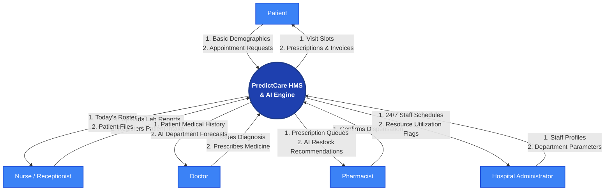
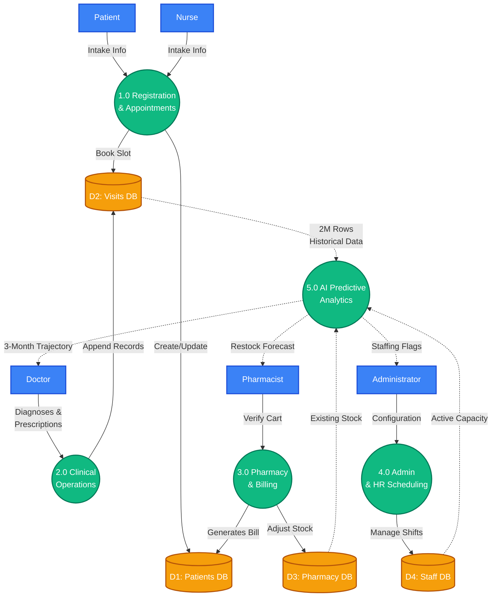
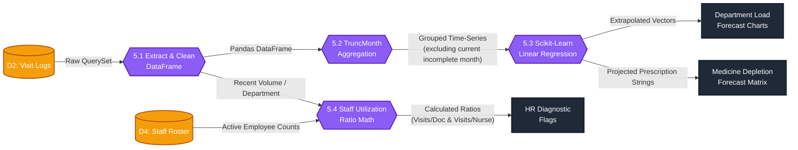

# PredictCare HMS - Multi-Level Data Flow Diagrams (DFD)

This document contains the formalized Data Flow Diagrams broken down into Context (Level-0), High-Level (Level-1), and Sub-Process (Level-2) representations for the Hospital Management and Analytics System.

---

## 1. Level-0 DFD (Context Diagram)
The Level-0 diagram treats the entire Hospital Management System as a single centralized process, showing only the external boundaries (Users) trading data with the main system.

---

## 2. Level-1 DFD (Major Sub-Systems)
The Level-1 diagram breaks the monolithic system out into its core application modules (Registration, Clinical, Pharmacy, HR, and AI Analytics) and their interactions with the relational databases.

---

## 3. Level-2 DFD (AI Forecasting Sub-Processes)
The Level-2 diagram selectively zooms deeply into Process 5.0 (AI Predictive Analytics) to detail exactly how the unformatted Django query data is mathematically transformed into dashboard predictions.

