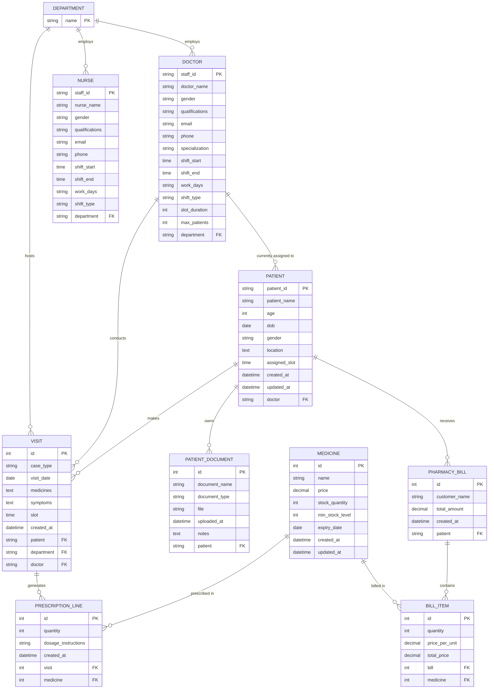

# PredictCare Hospital Management System - ER Diagram

This document contains the Entity-Relationship (ER) diagram for the PredictCare Hospital Management System, mapping the relationships between the Core Hospital module and the Pharmacy & Billing module.

## How to Read This Diagram:
* **`PK`**: Primary Key (Unique Identifier for the record)
* **`FK`**: Foreign Key (Reference to another table's Primary Key)
* **`||--o{`**: One-to-Many Relationship (e.g., One `DEPARTMENT` employs Many `DOCTORS`).
