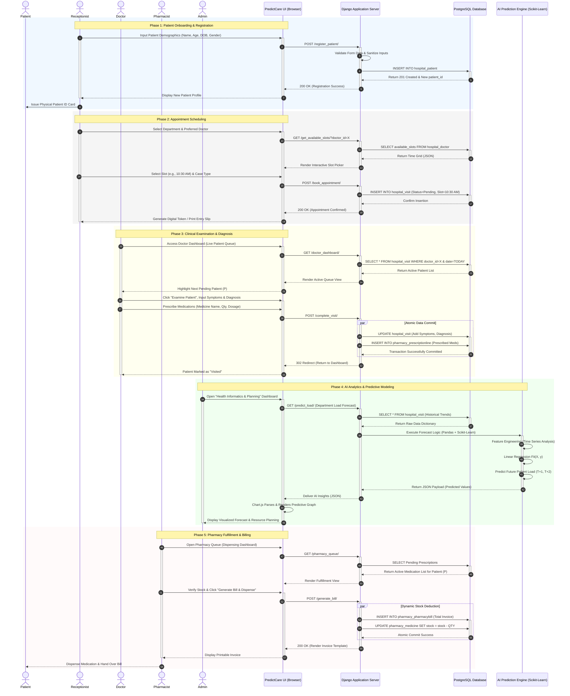

# PredictCare Hospital Management System - Master Sequence Diagram

This document contains a comprehensive, high-fidelity Unified Modeling Language (UML) Sequence Diagram for the PredictCare project. It illustrates the complete lifecycle of a patient and hospital operations, featuring multiple actors and specialized sub-systems.

---

## 1. Integrated Hospital Lifecycle Workflow

This diagram covers the end-to-end journey from registration to pharmacy dispensing, including advanced AI-driven load forecasting and clinical examination.

---

## 2. Key Component Definitions

- **PredictCare UI (Browser)**: A modern, responsive dashboard built with Django Templates and Chart.js for real-time visualization.
- **Django Application Server**: The core logic layer handling request routing, form validation, and business rules.
- **PostgreSQL Database**: The relational storage engine ensuring data integrity through atomic transactions.
- **AI Prediction Engine**: A specialized Python environment utilizing Scikit-Learn to provide data-driven insights for hospital management.

## 3. Workflow Summary

The system ensures seamless transition between different hospital roles (Front Desk, Clinic, AI Planning, Pharmacy) by maintaining a single source of truth in the PostgreSQL database. Each phase utilizes real-time API calls to keep all dashboards synchronized.
