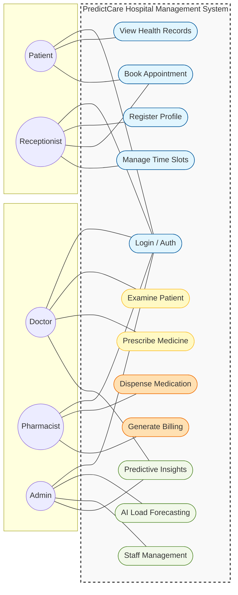

# PredictCare Hospital Management System - Use Case Diagram

This document contains a comprehensive Unified Modeling Language (UML) Use Case Diagram for the PredictCare system. It defines the primary actors, their roles, and the functional interactions within the system boundary.

---

## 1. Professional Use Case Model

Following the layout and structural depth of the "PROCTOR EDGE" reference, the following diagram illustrates the functional scope for all system actors.

---

## 2. Actor Roles & Primary Responsibilities

| Actor | Primary Responsibilities |
| :--- | :--- |
| **Patient** | User seeking health services, manages personal appointments and health history. |
| **Receptionist** | Front-desk staff managing patient onboarding, registration, and hospital queues. |
| **Doctor** | Clinical professional responsible for diagnosis, treatment, and medical prescriptions. |
| **Pharmacist** | Manages medication dispensing and invoice generation based on prescriptions. |
| **Admin** | System manager who utilizes AI load forecasting and analytics for resource planning. |

## 3. System Components Summary

- **Core Module**: Handles user authentication, patient registration, and appointment workflow.
- **Clinical Module**: Specifically designed for doctors to manage symptoms, diagnosis, and digital prescriptions.
- **Service Module**: Provides the AI engine for load forecasting and high-level administrative insights.
- **Pharmacy Module**: Manages inventory reconciliation and atomic billing transactions.
